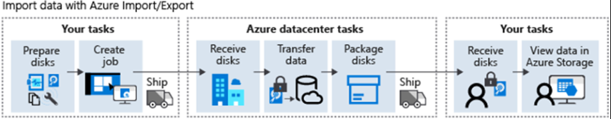

# Implement and Manage Storage in Azure

## Configure Storage Accounts

Storage Accounts are also known as Azure Storage.

Azure Storage can store files, messages, tables, file shares, working data, such as websites, mobile apps, desktop apps, and is also used by IaaS VMs and PaaS services.

Azure Storage supports three data categories:

* Virtual Machine Data - Disks (persistent storage) and files (file shares).
  * Azure Managed Disks
* Unstructured Data - Non-relational data. Mixed information stored together that may not be related.
  * Azure Blob Storage - Scalable, REST-based object store.
  * Azure Data Lake Storage - Hadoop Distributed File System (HDFS) as a service.
* Structured Data - Relational data with a shared schema, often contained in tables.
  * Azure Table Storage - Tables are an autoscaling NoSQL store.
  * Azure Cosmos DB - Globally distributed database service.
  * Azure SQL Database - Fully managed database-as-a-service built on SQL.

Storage Account tiers:

* Standard
  * HDD backed.
  * Lowest cost per GB
* Premium
  * SSD backed.
  * Low latency performance

<mark style="background-color:orange;">Storage Accounts can't be converted from one tier to another.</mark>

### Azure Storage Services

#### Azure Blob Storage

Object storage optimized for storing unstructured data such as text and binary data.

Use cases: Serving images and documents to a browser, storing files for distributed access, streaming audio, and video, storing data for backup and restore, disaster recovery and archiving.

Objects can be accessed via HTTP and HTTPS, NFS protocol, URLs, REST API, Azure CLI, PowerShell, or a client library in multiple languages (.NET, Java, NodPHP,,s, Python, PHP, and Ruby).

#### Azure Files

Network file share. Can be accessed using Server Message Block (SMB) protocol and Network File System (NFS) protocol, REST, and storage client libraries.

Multiple VMs can share the same files with both read and write access.

#### Azure Queue Storage

Used to store and receive messages, which can be up to 64KB in size. They are used to storage lists of messages to be processed asynchronously.

#### Azure Table Storage (Azure Cosmos DB)

Azure Table Storage is part of Azure Cosmos DB. Fully managed NoSQL database service. Cost-effective serverless and automatic scaling options. New service called Azure Cosmos DB Table API provides throughput-optimized tables, global distribution and automatically secondary indexes.

<figure><figcaption></figcaption></figure>

### Storage Account Types

Storage Account types:

| Storage account                                                                                                                  | Recommended usage                                                                                                                                                                                                 |
| -------------------------------------------------------------------------------------------------------------------------------- | ----------------------------------------------------------------------------------------------------------------------------------------------------------------------------------------------------------------- |
| [**Standard** **general-purpose v2**](https://learn.microsoft.com/en-us/azure/storage/common/storage-account-upgrade) **(GPv2)** | Standard storage account for most scenarios, including blobs, file shares, queues, tables, disks (page blobs) and data lake storage.                                                                              |
| [**Premium** **block blobs**](https://learn.microsoft.com/en-us/azure/storage/blobs/storage-blob-block-blob-premium)             | Block blob scenarios with high transaction rates or scenarios that use smaller objects or require consistently low storage latency.                                                                               |
| [**Premium** **file shares**](https://learn.microsoft.com/en-us/azure/storage/files/storage-how-to-create-file-share)            | Enterprise or high-performance scale file share applications. Use Premium file shares if you require support for both Server Message Block (SMB) and NFS file shares.                                             |
| [**Premium** **page blobs**](https://learn.microsoft.com/en-us/azure/storage/blobs/storage-blob-pageblob-overview)               | Premium high-performance storage account for page blobs only. Page blobs are ideal for storing index-based and sparse data structures, such as operating systems, data disks for virtual machines, and databases. |

<mark style="background-color:orange;">All storage account types are encrypted with Storage Service Encryption (SSE) for data at rest.</mark>

### <mark style="background-color:orange;">Replication</mark>

Storage accounts are always replicated.

#### Locally Redundant Storage (LRS)

Lowest cost replication. Replicates three replicas in the same datacenter. Useful in cases of data loss. Protects against single hardware failure (disk. node, rack).

Supported storage accounts: GPv1, GPv2, Blob

#### Zone Redundant Storage (ZRS)

Replicates data across three storage clusters (availability zones) in a single region. Each AZ is autonomous from each other. Protects against local AZ issues (networking, disasters). Isn't available in all regions.

Supported storage accounts: GPv2

#### Geo Redundant Storage (GRS)

Replicates three replicas in the same datacenter (LRS) and three replicas to a secondary region asynchronously. Protects against a regional outage or disaster. There are two GRS options:

* GRS - Data is available to be read in the secondary region only if Microsoft initiates a failover from the primary to secondary region.
* Read-access geo-redundant storage (RA-GRS) - Data is always available to be read from the secondary region.

Supported storage accounts: GPv1, GPv2, Blob

#### Geo-Zone Redundant Storage (GZRS)

Best replication solution. Mix of GRS and ZRS. Data is available to read/write in three availability zones and available in another region (GRS or RA-GZRS).

Supported storage accounts: GPv2

<figure><figcaption></figcaption></figure>

<figure><figcaption></figcaption></figure>

### Access Storage

Every object storage in Azure Storage has a unique URL address. Default endpoints are <mark style="color:blue;">`<storage_account_name>.<blob/table/queue/file>.core.windows.net`</mark>

You can also configure custom domains to access blob data by mapping a custom domain and subdomain to the blob or web endpoint.

Storage account names must be globally unique.

### Secure Endpoints

You can limit storage account access from the network by restricting access to selected virtual networks, subnets or IP addresses or by using a private link.

## Configure Azure Blob Storage

Blob Storage uses three resources to store and manage data:

Storage Account > Container > Blob

<figure><figcaption></figcaption></figure>

A blob can only exist within a container, which can storage an unlimited amount of blobs and a storage account can store an unlimited number of containers.

<mark style="background-color:orange;">A blob is the abstraction of a file in a container.</mark>

### Container Access Levels

* Private (default) - No anonymous access.
* Blob - Allows anonymous public read for the blobs.
* Container - Allows anonymous public read (blob) and list (container)

### Blob Access Tiers

| Compare                          | Hot tier                                               | Cool tier                                              | Archive tier                                             |
| -------------------------------- | ------------------------------------------------------ | ------------------------------------------------------ | -------------------------------------------------------- |
| **Availability**                 | 99.9%                                                  | 99%                                                    | Offline                                                  |
| **Availability (RA-GRS reads)**  | 99.99%                                                 | 99.9%                                                  | Offline                                                  |
| **Latency (time to first byte)** | milliseconds                                           | milliseconds                                           | hours                                                    |
| **Minimum storage duration**     | N/A                                                    | 30 days                                                | 180 days                                                 |
| **Usage costs**                  | Higher storage costs, Lower access & transaction costs | Lower storage costs, Higher access & transaction costs | Lowest storage costs, Highest access & transaction costs |

Blob access tiers can be changed at any time.

### Lifecycle Management

Azure Blob Storage lifecycle management policy rules can be used to:

* Transition blobs to cooler storage tiers.
* Delete blobs at the end of their lifecycle.

If / Then based rules:

**If** last modified/created more than x days ago\
**Then** move to cool/archive or delete&#x20;

### Blob Object Replication

Blob replication is based on policy rules configured by the user. They're replicated asynchronously. The replication happens between two (source/destination) storage accounts at the container level.

Blob replication is independent of the storage account replication type. By using blob replication, you can save money by only replicating to another region required data and not the complete storage account.

Considerations:

* Blob versioning must be enabled on both source and destination storage accounts.
* Replication doesn't support blob snapshots.
* Replication is supported for Hot and Cool tiers. Source and destination can be in different tiers.
* In the policy, you must specify source and destination storage accounts and containers, and the blobs in the source container that will be replicated.
* Can be used to reduce latency by replicating data across multiple regions.

### Blob Types

* Block Blob - Consists of blocks of data. Ideal for text and binary (files, images, videos).
* Append Blob - Also consists of blocks of data but is optimized for append operations. Useful for logging scenarios.
* Page Blob - Can be up to 8TB. More efficient for frequent read/write operations. VMs uses page blobs for operating system disks and data disks.
* After a blob is created, it's type can't be changed.

### Upload Blobs

Upload tools:

* Azure Storage Explorer - Azure Portal
* AzCopy - Command-line tool.
* Azure Data Box Disk - Service for transferring massive amounts of on-premises data. You copy data to physical disks and send then to Microsoft to be uploaded into Blob Storage.
* Azure Import/Export - Service to export data from Blob Storage. You provide hard drives to Microsoft, who will copy the data to the disks and send back to you.

### Blob Storage Pricing

* Performance Tiers
  * Access (transaction) and storage costs.
  * Changes to tiers - Cool to Hot charges reading all data. Hot to Cool charges writing all data.
* Replication and Outbound data transfer
  * Data transfers out of an Azure Region (GRS/RA-GRS) incur billing for bandwidth usage on a per-gigabyte basis.

## Configure Azure Storage Security

URL that grants restricted access to Azure Storage resources.

* **Encryption**. All data written to Azure Storage is automatically encrypted by using Azure Storage encryption.
* **Authentication**. Azure Active Directory (Azure AD) and role-based access control (RBAC) are supported for Azure Storage for both resource management operations and data operations.
  * Assign RBAC roles scoped to an Azure storage account to security principals, and use Azure AD to authorize resource management operations like key management.
  * Azure AD integration is supported for data operations on Azure Blob Storage and Azure Queue Storage.
* **Data in transit**. Data can be secured in transit between an application and Azure by using Client-Side Encryption, HTTPS, or SMB 3.0.
* **Disk encryption**. Operating system disks and data disks used by Azure Virtual Machines can be encrypted by using Azure Disk Encryption.
* **Shared access signatures**. Delegated access to the data objects in Azure Storage can be granted by using a shared access signature (SAS).
* **Authorization**. Every request made against a secured resource in Blob Storage, Azure Files, Queue Storage, or Azure Cosmos DB (Azure Table Storage) must be authorized. Authorization ensures that resources in your storage account are accessible only when you want them to be, and to only those users or applications whom you grant access.
  * **AAD authorization** - Access to users, groups and applications (service principals) with RBAC.
  * **Shared Key** - Key used for authorization.
  * **Shared Access Signature (SAS)** - Delegates access to a particular resource with specified permissions for a defined time interval.
  * **Anonymous Access (containers and blobs)** - Unauthorized public read access.

### Shared Access Signature (SAS)

* Granular control over permissions granted with the SAS.
* Valid for a period of time (start time/expiration time).
* Account-level SAS can delegate access to one or more Azure Storage services.
* Service-level SAS can delegate access to a resource in only one Azure Storage service.
* Stored Access Policy controls are applied on top of SAS permissions.
* You can specify an IP address or range to be allowed to use the SAS.
* You can specify the use of HTTPS only or HTTPS and HTTP.

### Encryption

All Azure Storage data is encrypted at rest using AES 256-bit. Data is decrypted before its retrieved.

Customer managed keys can also be used. Azure Key Vault must be in the same region as the storage account but doesn't need to be in the same subscription.

## Configure Azure Files and Azure File Sync

Uses Server Message Block (SMB) protocol and/or NFS. VMs (cloud and on-prem) and cloud services uses file share data by using mounted shares.

Any number of VMs can mount and access a file share at the same time.

Azure file is a good option when you want to store files, and development or debugging tools that needs to be accessed from multiple VMs. Also good for application lift and shift.

<mark style="background-color:orange;">SMB protocol uses port 445. Enabling escure transfer is a best practice (HTTPS).</mark>

File shares can be mounted to windows using a provided PowerShell code. You can use AD or a shared key to connect.

In Linux, File Share is mounted using CIFS kernel client, with command mount. To make it persistent, create an entry in `/etc/fstab`

You can create snapshots of file shares, with point-in-time read-only data. Snapshots are incremental and it's possible to restore a single file from it. File Shares with snapshots can only be deleted after the snapshots are deleted.

Azure File Sync can be used to transform a VM into a cache for a File Share. Other VMs can pull data from that cache instead of directly from Azure File Share.

File Sync supports cloud tiering, with that you can make hot files being stored in a cache server and cold files stored only on File Share. Access to cold files is transparent to user, as it appears to be in the server as well, only marked with an offline `0` file attribute.

## Configure Azure Storage with Tools

### Azure Storage Explorer

Standalone application (win, liunx and macOS) to work with Azure Storage from your machine.

Storage Explorer requires permissions on AAD level and data layer (storage account/services) permissions for full access.

With Storage Explorer you can:

* Connect to an Azure Subscription and manage storage resources within it.
* Attach a Storage Account (from a sub that you don't have access) with an access key and endpoint.
* Attach a Storage Account with a SAS
* Attach a storage service with a SAS (blob container, queue or table)

### Azure Import/Export Service

Used to import your local data (HDD/SSD) to Blob Storage or Azure Files or export data from Blob Storage and Azure File to HDD/SSD.

Data import/export jobs can be created from the portal or using the REST API.

<figure><figcaption></figcaption></figure>

<figure><figcaption></figcaption></figure>

WAImportExport tool is used to import/export data to the disks. It encrypts data with BitLocker and generate a journal files to document the data transfer.

WAImportExport is available in two versions and is only compatible with 64bit Windows:

* Version 1 is best for importing/exporting data in Blob Storage
* Version 2 is best for importing data into Azure Files

### AzCopy Tool

Alternate method for transferring data to and from Blob Storage and Azure Files from the command line. It can even be used to copy data between two storage accounts. It can also be used to list or remove files or blobs.

It's built into Azure Storage Explorer and is also available for Windows, Linux and macOS.

Authentication can be done with AAD (Blob Storage and Data Lake Storage Gen2) and SAS tokens (Blob Storage and Azure Files).

```bash
azcopy copy [source] [destination] [flags]
```

## Create an Azure Storage Account

Azure Storage:

<figure><figcaption></figcaption></figure>

Storage Account:

<figure><figcaption></figcaption></figure>

Azure Services like Azure SQL and Cosmos DB are not part of a Storage account.

<figure><figcaption></figcaption></figure>

It's useful to group use multiple services in the same storage account to apply same settings and controls to all services facilitating management.

You should use different storage accounts if you need different settings for different data (region, replication, access, billing, performance) or if you require data isolation.

## Control Access to Azure Storage with Shared Access Signatures

Access options:

* **Public access**
* **AAD** - Best for apps with managed identities or security principals.
* **Shared key** - Two keys are always created. They grant root access to the storage account. Use Azure Key Vault to manage those keys.
* **SAS** - Key that grants granular level of access to a storage account.
  * **User delegation SAS**: Can only be used for Blob storage and is secured with Azure AD credentials.
  * **Service SAS**: A service SAS is secured using a storage account key. A service SAS delegates access to a resource in any one of four Azure Storage services: Blob, Queue, Table, or File.
  * **Account SAS**: An account SAS is secured with a storage account key. An account SAS has the same controls as a service SAS, but can also control access to service-level operations, such as Get Service Stats.

### Stored Access Policies

Without a stored access policy, if a SAS is compromised, the only way to revoke it before expiration is to regenerate access keys, which requires you to update all apps that are using the old shared key.

```bash
az storage container policy create \
    --name <stored access policy identifier> \
    --container-name <container name> \
    --start <start time UTC datetime> \
    --expiry <expiry time UTC datetime> \
    --permissions <(a)dd, (c)reate, (d)elete, (l)ist, (r)ead, or (w)rite> \
    --account-key <storage account key> \
    --account-name <storage account name> \
```

You create a SAS token and associate it with a store access policy.

## Upload, Download and Manage Data with Azure Storage Explorer

Also supports Azure Data Lake Storage

* Azure Data Lake, based on Apache Hadoop, is designed for large data volumes and can store unstructured and structured data. Azure Data Lake Storage Gen1 is a dedicated service. Azure Data Lake Storage Gen2 is Azure Blob Storage with the hierarchical namespace feature enabled on the account.

Storage Explorer can also emulate a storage account so developers can test stuff locally without costs.

* Azure Storage Emulator uses a local instance of Microsoft SQL Server 2012 Express LocalDB. It emulates Azure Table, Queue, and Blob storage.
* Azurite, which is based on Node.js, is an open-source emulator that supports most Azure Storage commands through an API.
